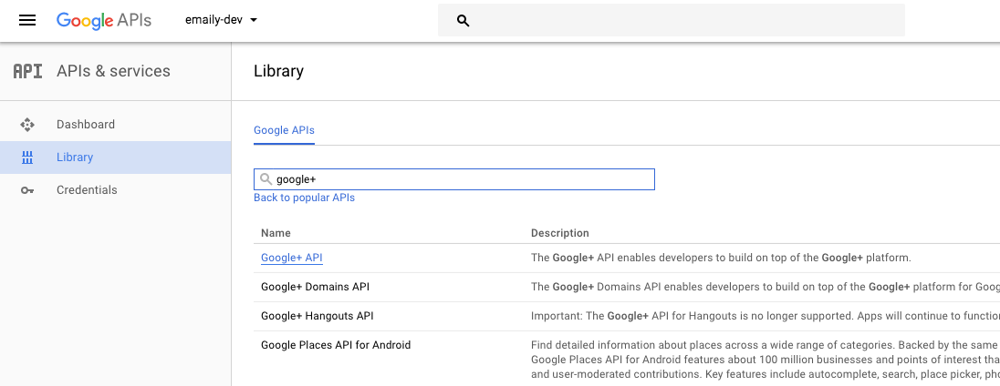

# Authentication with Google OAuth

### Contents

1. Intro to Google OAuth

---

### 1. Google OAuth Flow

We want to have a button 'Sign in with Google'.


When users click the login button, they will be redirected to a route like `'localhost:5000/auto/google'`. We then send the request to Google. Google will then ask the user if they grant permission.

If the user grants the permission, we can get a code from the callback url. We can send request to Google with this code and ask for some user information. The create a new record in our database with the user info.

---

### 2. Passport JS

#### 2.1. What is Passport

We're going to approach the OAuth problem with a library [Passport](http://passportjs.org/). We can use it to create the authentication flow.

Two libraries are needed to be installed:

* **passport:** General helpers for handling auth in Express apps.
* **passport strategy:** Helpers for authentication with one very specific method (email/pwd, Google, Facebook, etc).

#### 2.2. Passport Setup

Install several libraries (passport and a passport strategy named [passport-google-oauth20](https://github.com/jaredhanson/passport-google-oauth2)):
```
npm install --save passport passport-google-oauth20
```

Just put everything in './index.js' for now, and we will come back to refactor it in the future.

```javascript
// ./index.js
//---------------------------------------------------------
// Import Passport and a property from the strategy
const passport = require("passport");
const GoogleStrategy = require("passport-google-oauth20").Strategy;
// Use Passport
passport.use(new GoogleStrategy());
```

#### 2.3. Enabling Google OAuth API

We need to pass some options to `GoogleStrategy`. The app has to be signed up with Google OAuth API in [https://console.developers.google.com](https://console.developers.google.com). I created a new project named `emaily-dev`.


Then click the button `'ENABLE APIS'`. Search for 'google+' then click the `'ENABLE'` button:




Create credentials and create client ID:


