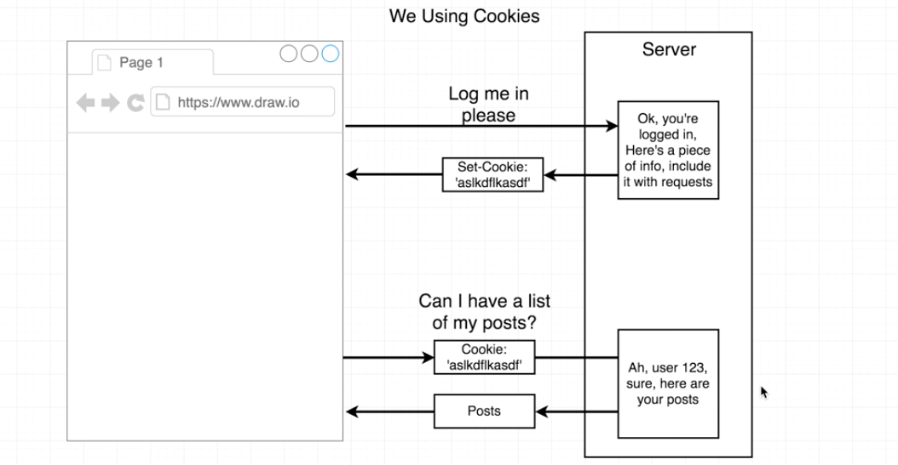
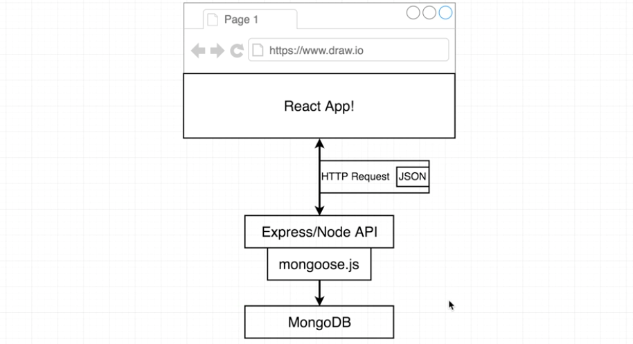
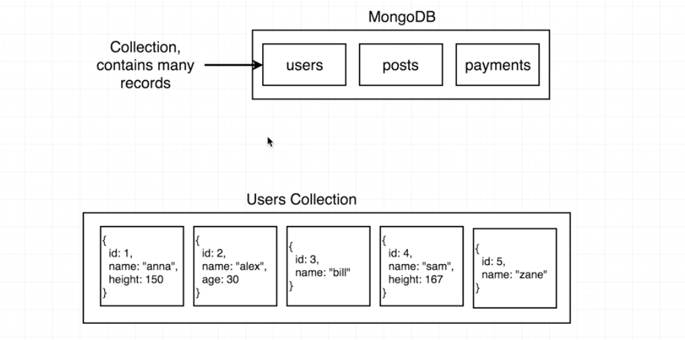

# Adding MongoDB

### Contents

1. Server Structure Refactor
2. Sign In Users with OAuth
    * Theory of Authentication
    * High-level Overview of the Process


---

### 1. Server Structure Refactor

Putting everything in `./index.js` is not a good idea. We can create 3 different folders and a file:

* **config:** Protected API keys and settings.
* **routes:** All route handlers, grouped by purpose.
* **services:** Helper modules and business logic.
* **index.js:** Helper modules and business logic.

Move something out from `./index.js`:

```javascript
// ./routes/authRoutes.js
//---------------------------------------------------------
// This is the initial passport module.
// Not the one created in './services/passport.js'.
const passport = require("passport");

module.exports = (app) => {
  // Google OAuth
  app.get(
    "/auth/google",
    passport.authenticate('google', {
      scope: ['profile', 'email']
    })
  );
  // Callback
  app.get(
    "/auth/google/callback",
    passport.authenticate('google')
  );
}

// ./services/passport.js
//---------------------------------------------------------
const passport = require("passport");
const GoogleStrategy = require("passport-google-oauth20").Strategy;
const keys = require("../config/keys");

passport.use(
  new GoogleStrategy(
    {
      clientID: keys.googleClientID,
      clientSecret: keys.googleClientSecret,
      callbackURL: "/auth/google/callback"
    },
    (accessToken, refreshToken, profile, done) => {
      console.log('access token', accessToken);
      console.log('refresh token', refreshToken);
      console.log('profile', profile);
    }
  )
);
```

We also need to import everything from `./routes/` and `./services/` to our homepage:
```javascript
// ./index.js
//---------------------------------------------------------
require("./services/passport");
// This is a function that takes our 'app' and attach two routes to it.
const authRoutes = require("./routes/authRoutes");
const app = express();
authRoutes(app);
```


Actually, we can ignore the variable `authRoutes` and simplify `./index.js`:
```javascript
// ./index.js
//---------------------------------------------------------
// Before:
const authRoutes = require("./routes/authRoutes");
const app = express();
authRoutes(app);
// After:
const app = express();
require("./routes/authRoutes")(app);
```

---

### 2. Sign In Users with OAuth

#### 2.1. Theory of Authentication

After getting the accessToken from Google, let's figure out what it really means to authenticate the user.

We communicate between our browser and our Express by HTTP request. By default, information btw requests are not shared. The token is the proof that we are the right person who made the original request. We are going to use cookie-based authentication.



When we made the initial request, the response will have a header `'Set-Cookie'`, with the value which can uniquely identify the user. The browser will then store it in the browser's memory. The cookie will be automatically appended to any following request to the server.

#### 2.2. High-level Overview of the Process

The user will sign up first and sign out. He will sign in sometime in the future with the same email and password.

Remember we can get his Google profile when he signed up or signed in. We need to find some unique identifying token in the user's Google profile. Is that consistent between logins? Use that to decide if the user is the same. `id` from Google's profile is a good pick. That is the unique ID for this particular user, which will never change over time.


The whole OAuth purpose is to give us the Google ID, we just care about the ID. The critical part for identifying the user is the MongoDB. We'll set it up later.

---

### 3. MongoDB Setup

#### 3.1. Introduction to MongoDB

Our Express server will communicate with MongoDB to save or pull out records. We will use a library called `mongoose.js`. It wrapped up a lot of operations and will make our lives easier.



MongoDB internally stores records into different collections. Every single record is a JSON object. One of the important defining characteristics of MongoDB is `schemaless`. Every record can have its own distinct properties.



What Mongoose will do for us? MongoDB has its own structure as we described above. To represent the type of structure in the JavaScript world, we have two important concepts implemented by Mongoose.

* Model Class: a model class represents an entire MongoDB collection.
* Model Instance: a JavaScript object that represents a single record sitting inside a collection.


#### 3.2. Setup MongoDB and Wire It Up with Express

We can remotely hosted MongoDB using a third-party service called [mlab](https://mlab.com/), which is much easier. Just create an account and create a new deployment with AWS as the cloud provider


After creating a new database, we need a new database user (not an application user). Go to database console and open `User` tab to create one.


#### 3.3. Connecting Mongoose to MongoDB

Install Mongoose locally:
```
npm install --save mongoose
```
Import mongoose it to `./index.js` and connect it to the MongoDB we just created:
```javascript
// ./index.js
//---------------------------------------------------------
const mongoose = require('mongoose');
const keys = require('./config/keys');
// Pass the address in, the address is in mlab console. Save it to ./config/keys.js for security.
mongoose.connect(keys.mongoURI);
```
Now we installed MongoDB and Mongoose. What to do next:

* Need to be able to identify users who sign up and return to our application. We want to save the 'id' in their google profile.
* Use Mongoose to create a new collection in Mongo called `'users'`.
* When user signs in, save new record to the `'users'` collection.

---

### 4. Working with Mongoose

#### 4.1. Mongoose Model Classes

Let's create a model class using Mongoose, which will allow us to create a new collection in MongoDB. We want to find a suitable location to do that: `./models/`. This directory will contain all the models that we created using Mongoose.
```javascript
// ./models/User.js
//---------------------------------------------------------
const mongoose = require('mongoose');
const { Schema } = mongoose; // ES2015 version of: const Schema = mongoose.Schema;
// Define a schema, what records will look like
const userSchema = new Schema({
  googleId: String // Define the type, 'Number' is another option.
});
// First parameter is the name of the collection.
mongoose.model('users', userSchema);
```

Then import it in `./index.js`:
```javascript
// ./index.js
//---------------------------------------------------------
require("./models/User");
```

#### 4.2. Saving Model Instances

Remember we have a callback function after OAuth procedure in `'./services/passport.js'` and a parameter `'profile'` which contains a Google ID.
```javascript
// ./services/passport.js
//---------------------------------------------------------
// Make sure we get access to the database
const mongoose = require('mongoose');
// Get access to the database collection 'user'.
const User = mongoose.model("users");
```

We also used the function `mongoose.model("users", userSchema);` in `'./models/User.js'`. If we pass in two parameters, we will create a collection with a schema. If we use only one parameter, we will pull the model out of Mongoose.

After we have the model class `User`, we can create a new model instance using that model class, and save it to the database.
```javascript
// ./services/passport.js
//---------------------------------------------------------
passport.use(
  new GoogleStrategy(
    {
      clientID: keys.googleClientID,
      clientSecret: keys.googleClientSecret,
      callbackURL: "/auth/google/callback"
    },
    (accessToken, refreshToken, profile, done) => {
      // Creates a new instance of the user.
      // Not saved to database yet if we forget '.save()'
      new User({ googleId: profile.id }).save();
    }
  )
);
```
