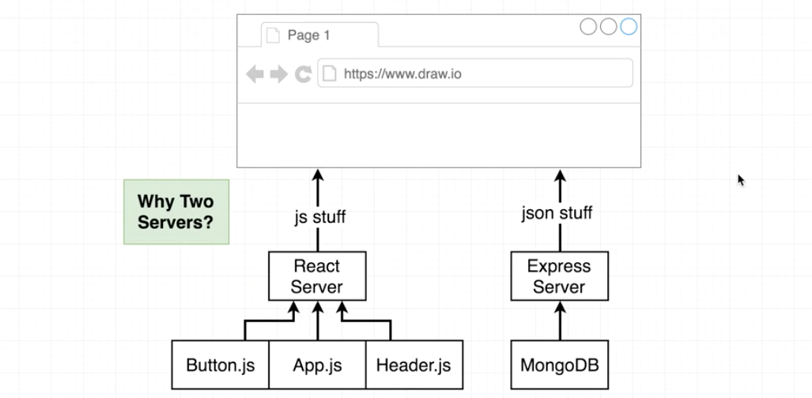

# Moving to the Client Side

### Contents

1. [React App Generation](#)


---

### 1. React App Generation

We are going to move to the client side with React. Note that setting up the client side is easy but understanding how it works with Express is complicated.

[create-react-app](https://github.com/facebookincubator/create-react-app) is a prefect module to generate a React app. Be sure to check out the documentation in the link provided, it's super easy to modify the project (e.g. adding SASS).

```
sudo npm install -g create-react-app
```

Use it to generate a new app:
```
create-react-app client
```

We now have a new folder `./client/`. The front-end app has its own built-in server. We can go into the `./client/` directory and run `npm start` to start the React application. We can go to `http://localhost:3000` to view the application:


Why does the React application have its own server? Here is a diagram showing how things are structured:



We setup the Express server before. It serves data and generates JSON response for requests from the browser. The React server will bundle different files and generate a file `bundle.js`, then load it to the browser.

* React server: Serving up the front-end app assets.
* Express server: Serving up all the data.
