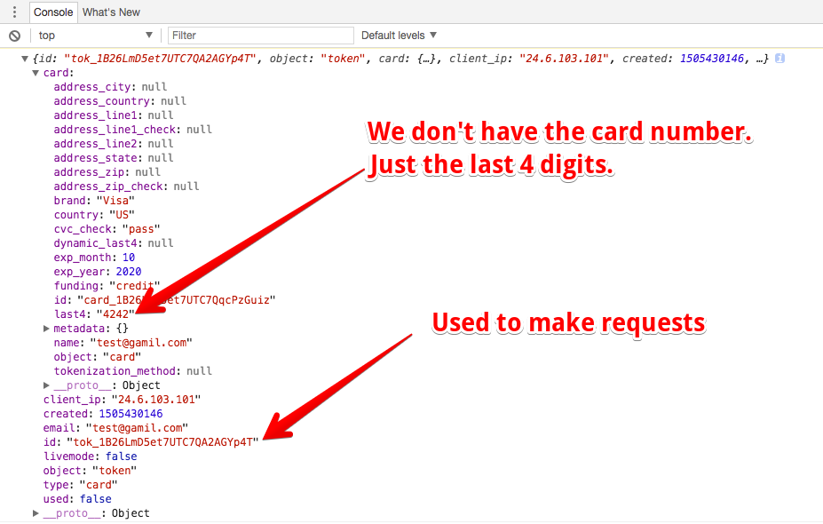
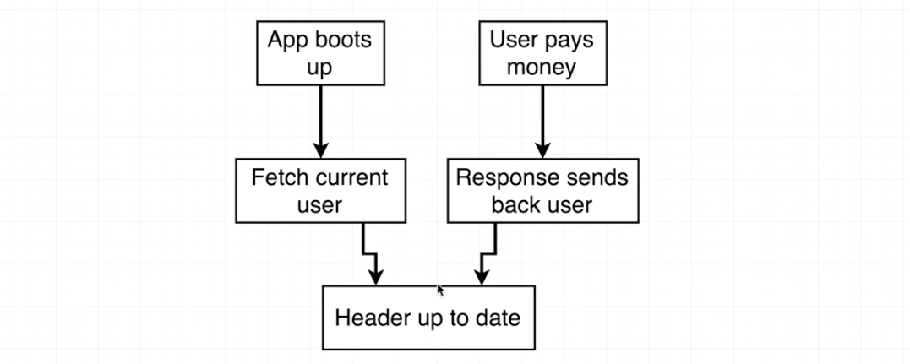
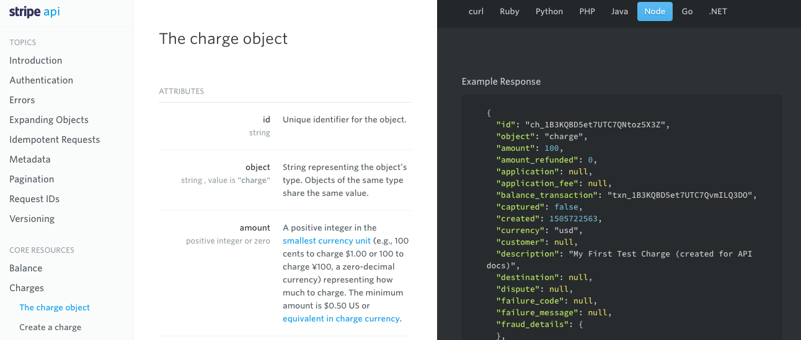
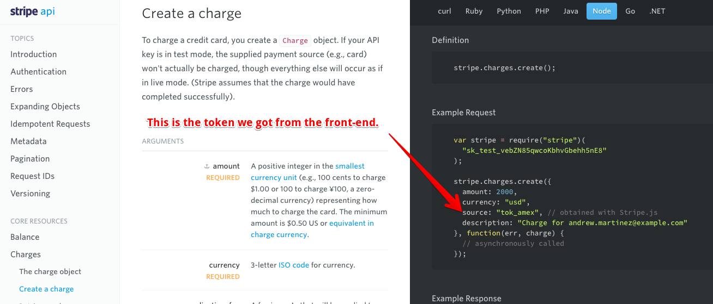
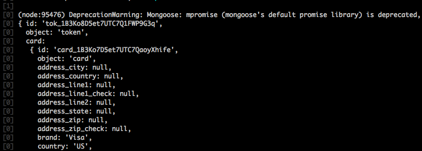

# Handling Payments

### Contents

1. [Client Side Billing](#)
    * [Intro and Billing Considerations](#)
    * [Stripe Billing Process](#)
    * [Stripe API Keys](#)
    * [The Payments Components](#)
    * [Reusing Action Types](#)
2. [Sever Side Billing](#)
    * [Post Request Handlers](#)
    * [Creating Charges](#)
    * [BodyParser Middleware](#)
    * [aaaa](#)
    * [aaaa](#)
    * [aaaa](#)

---

### 1. Client Side Billing

#### 1.1. Intro and Billing Considerations

In this section, let's work on another feature that will eventually lead us back to the header. Here is the diagram about what we are working on. Everything in blue is related to the client side. We'll move on to work on billing, which is accepting credit cards and payments.


The mock-up is as follows. Each dollar is equivalent to one credit. Each credit allows the user to set up one survey.


We have some considerations for the billing process. The first one is what happens when user clicks on `'Add Credits'` button: A form will show up:


This form looks easy, but the logic behind it is far more complicated. Here are rules of billing to keep in mind:

* We are bad at security
  * Never accept raw credit card numbers.
  * Never store credit card numbers.
  * Always use an outside payment processor.
* Billing is hard
  * Possible to avoid monthly payments/multiple plans?
  * Fraud and chargebacks are a pain.

[Stripe](https://stripe.com/) is a nice third-party payment processor and it takes all security issues.

#### 1.2. Stripe Billing Process

Let's take on look at how Stripe handles the billing process in our application. Here is a diagram of the workflow:


Everytime we want to receive a payment, we tell the Stripe plugin to generate a payment form. So we'll never accept credit numbers ourselves. Details will be sent directly to Stripe API. Stript will try to charge the credit card and send us a token. We send the token to our API to figure out the total amout we want to charge, and then call Stripe API with the token and the amount to charge the user.

The reason the process it this way is that we don't want to figure out the total amount in the front-end. So that a malicious user can not change the amount manually in the front-end.

Let's create a Stripe account and implement it. By default, the account is in test mode, which allows us to accept fake credit card numbers. You can click `'Active your account'` on the left-bar to make it real.

We need an API key to move on. It works quite similar with Google API keys.


We saved our keys in `./config/`, but this folder is accessible only for our back-end server. We can not use the same approach for billing keys since we need to access the publishable key on the front-end. Any content that is imported to React is visible to public.

Next step is to install a plugin that allows Stripe to accept credit cards and show a form to our users: [Stripe Checkout (checkout.js)](https://stripe.com/checkout) and [react-stripe-checkout](https://github.com/azmenak/react-stripe-checkout)

```
cd client
npm install --save react-stripe-checkout
```

#### 1.3. Stripe API Keys

After installing `'react-stripe-checkout'`, we want to make sure that the Stripe publishable API key is accessible to our front-end. We also want both the publishable key and the secret key to be accessible to the back-end server. Let's take care of the back-end first:

```javascript
// ./config/dev.js
//---------------------------------------------------------
module.exports = {
  ...
  stripePublishableKey: "xxxxxxx",
  stripeSecretKey: "xxxxxxx"
};
//---------------------------------------------------------
// ./config/prod.js
//---------------------------------------------------------
module.exports = {
  ...
  stripePublishableKey: process.env.STRIPE_PUBLISHABLE_KEY,
  stripeSecretKey: process.env.STRIPE_SECRET_KEY
};
```

Setup the keys in our Heroku dashboard:


We can not use the logic in `./config/keys.js` to determine which file to import for the client side. The front-end of our application is making use of ES2015 modules (with keyword `'import'`), the back-end uses common JS (keyword `'require'`).

* In common JS modules, we can have some logic executed before we decide what file to require in.
* In ES2015 modules, we are not allowed to execute any type of logic before listing `import` statements.

Fortunately, the [create-react-app](https://github.com/facebookincubator/create-react-app) library which we used to generate the client side already has a solution for handling variables like this: [Adding Custom Environment Variables](https://github.com/facebookincubator/create-react-app/blob/master/packages/react-scripts/template/README.md#adding-custom-environment-variables)

You must create custom environment variables beginning with `REACT_APP_`. These environment variables will be defined for you on `process.env`. For example, having an environment variable named `REACT_APP_SECRET_CODE` will be exposed in your JS as `process.env.REACT_APP_SECRET_CODE`.

We use the way to store variables in `./client/.env.development` and `./client/.env.production` files:


```javascript
// ./client/.env.development
//---------------------------------------------------------
REACT_APP_STRIPE_KEY=pk_test_EtPoOYabdZqfX4AtFvNOLk9h
//---------------------------------------------------------
// ./client/.env.production
//---------------------------------------------------------
REACT_APP_STRIPE_KEY=pk_test_EtPoOYabdZqfX4AtFvNOLk9h
```

We can then test whether we can access the key in the client-side by adding the follow line in `./client/src/index.js`:

```javascript
console.log('STRIPE KEY IS', process.env.REACT_APP_STRIPE_KEY);
console.log('Environment is', process.env.NODE_ENV);
```


#### 1.4. The Payments Components

Let's create a new component to wrap up the payment configurations and display the button `'Add Credits'` int the header: `./client/src/components/Payments.js`:

```javascript
// ./client/src/components/Payments.js
//---------------------------------------------------------
import React, { Component } from 'react';
import StripeCheckout from 'react-stripe-checkout';
class Payments extends Component {
  render() {
    // amount: Amount of money we want to receive, we need to specify the currency. Default US dollars.
    // The unit is cent, so we should enter 500 if we want 5 dollars.
    // token: A callback function that will be called after we received an authorized token from Stripe API.
    // name: Header displayed in the pop-up window.
    // description: Some text displayed
    return (
      <StripeCheckout
        name="Emaily"
        description="$5 for 5 email credits"
        amount={500}
        token={token => console.log(token)}
        stripeKey={process.env.REACT_APP_STRIPE_KEY}
      />
    );
  }
}
export default Payments;
```

Then import the Payments component into the header:
```javascript
// ./client/src/components/Header.js
//---------------------------------------------------------
import Payments from './Payments';
...
  renderContent() {
    switch (this.props.auth) {
      ...
      default:
        return [
          <li key="1"><Payments /></li>,
          <li key="2"><a href="/api/logout">Logout</a></li>
        ];
    }
  }
...
```

Now we'll have an ugly button in the header. A pop-up window will show up if we click it:


After making payment with some fake information, the token will be returned. We defined the callback function in `./client/src/components/Payments.js` for `StripeCheckout`. We care about the `id` property and we can use it to make further request to Stripe API.



We can pass in a child component to `StripeCheckout` to change the style:

```javascript
// ./client/src/components/Payments.js
//---------------------------------------------------------
...
  return (
    <StripeCheckout
      name="Emaily"
      description="$5 for 5 email credits"
      amount={500}
      token={token => console.log(token)}
      stripeKey={process.env.REACT_APP_STRIPE_KEY}
    >
      <button className="btn">Add Credits</button>
    </StripeCheckout>
  );
...
```

#### 1.5. Reusing Action Types

After the user made the payment, remaining credits in the header should be updated. We also want to save the number of credits in the user model. We can reuse the `authReducer` to update the header.



We just need to make a new action creator to communicate with the backend:

```javascript
// ./client/src/actions/index.js
//---------------------------------------------------------
// Handle token from Stripe API
export const handleToken = token => async dispatch => {
  const res = await axios.post("/api/stripe", token);
  // What type of action do we want to dispatch
  // We can use 'FETCH_USER' just like before
  dispatch({ type: FETCH_USER, payload: res.data });
};
```

Now we have the action creator, we need to make sure that it is called whenever we get a token from the Stripe checkout form. To do this, import the creators into `./client/src/components/Payments.js`:

```javascript
// ./client/src/actions/index.js
//---------------------------------------------------------
import { connect } from 'react-redux';
import * as actions from '../actions';
...
  return (
    <StripeCheckout
      name="Emaily"
      description="$5 for 5 email credits"
      amount={500}
      token={token => this.props.handleToken(token)} // Call our action creator
      stripeKey={process.env.REACT_APP_STRIPE_KEY}
    >
      <button className="btn">Add Credits</button>
    </StripeCheckout>
  );
...
export default connect(null, actions)(Payments);
```

---

### 2. Server Side Billing

#### 2.1. Post Request Handlers

Our Express API does not have a route handler set up to watch for post requests to the route. Let's create one and add some logic to handle all the Stripe charging stuff.

Create a new file containing all the billing handlers: `./routes/billingRoutes.js`:

```javascript
// ./routes/billingRoutes.js
//---------------------------------------------------------
module.exports = app => {
  // This is used in the action creator in "./client/src/actions/index.js"
  app.post("/api/stripe", (req, res) => {});
};

//---------------------------------------------------------
// ./index.js
//---------------------------------------------------------
...
// Billing Route Handler
require("./routes/billingRoutes")(app);
...
```

#### 2.2. Creating Charges

We need a npm module to work with Stripe on the backend. It will take the token from front-end and turn it into actural charge to the credit card: [stripe api wrapper](https://www.npmjs.com/package/stripe). The full documentation about charges can be viewed here: [https://stripe.com/docs/api/node#charges](https://stripe.com/docs/api/node#charges)

```
npm install --save stripe
```

The `charge object` described in the doc is what we can get from Stripe API after charging.



We need to figure out what to send to the Stripe API to create a charge here: [Create a charge](https://stripe.com/docs/api/node#create_charge)



#### 2.3. BodyParser Middleware

When you make a request to the Express server in the action creator, Express does not by default parse the request payload. We need to install another little module to instruct Express to take the request body, parse it and make it available to everything inside of our application.


The description for the module `body-parser` is [here](https://www.npmjs.com/package/body-parser): Parse incoming request bodies in a middleware before your handlers, available under the `req.body` property.

```
npm install --save body-parser
```
Use it in the `./index.js`. Since this is a middleware, it should be wired up wit `'app.use()'` call.
```javascript
// ./index.js
//---------------------------------------------------------
const bodyParser = require("body-parser");
// Apply Middleware: bodyParser
// When a request with body comes in, the middleware will parse the body
// and assign it to 'req.body' of the incoming request.
app.use(bodyParser.json());
```

#### 2.4. Creating a Charge Object

We can test the body-parser by `console.log(req.body)` in our router. After submitting the payment form, the payload can be viewed in the terminal:

```javascript
// ./routes/billingRoutes.js
//---------------------------------------------------------
const keys = require("../config/keys");
const stripe = require("stripe")(keys.stripeSecretKey);
module.exports = app => {
  app.post("/api/stripe", (req, res) => {
    console.log(req.body); // To test the body-parser middleware
  });
};
```


