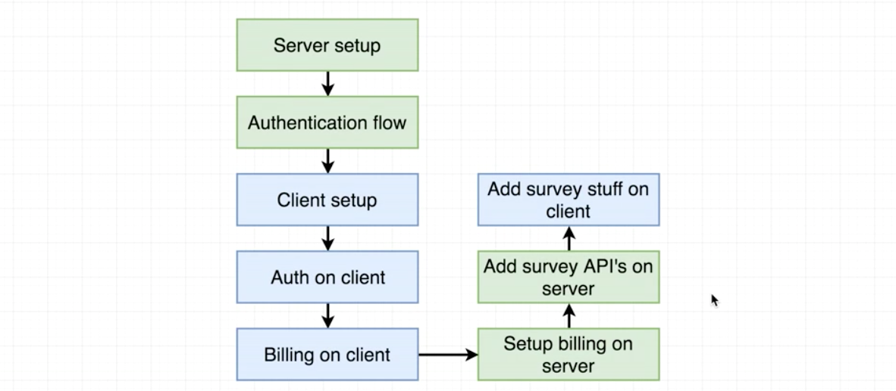
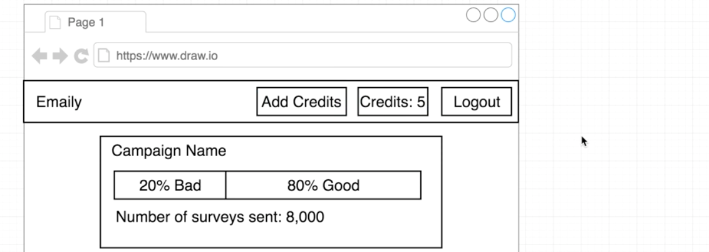
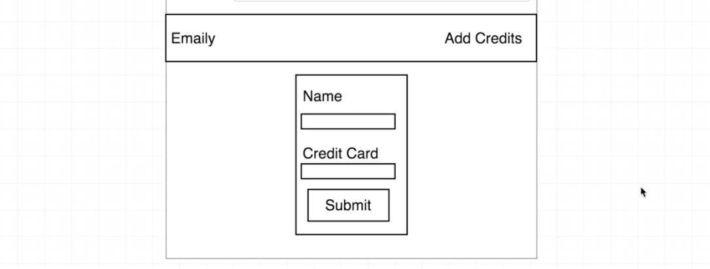
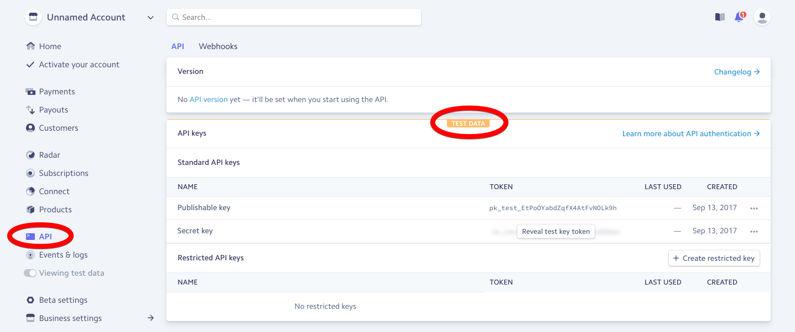
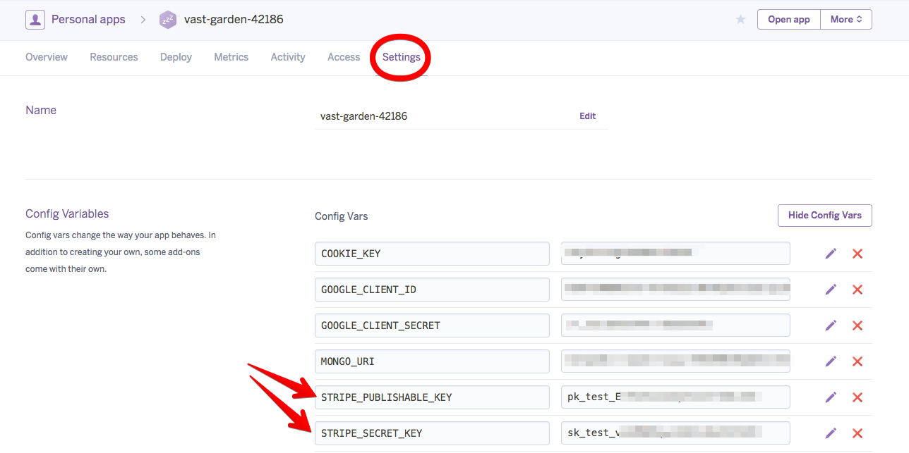

# Handling Payments

### Contents

1. [Client Side Billing](#)
    * [Intro and Billing Considerations](#)
    * [Stripe Billing Process](#)
    * [Stripe API Keys](#)
    * [The Payments Components](#)
    * [](#)

---

### 1. Client Side Billing

#### 1.1. Intro and Billing Considerations

In this section, let's work on another feature that will eventually lead us back to the header. Here is the diagram about what we are working on. Everything in blue is related to the client side. We'll move on to work on billing, which is accepting credit cards and payments.



The mock-up is as follows. Each dollar is equivalent to one credit. Each credit allows the user to set up one survey.



We have some considerations for the billing process. The first one is what happens when user clicks on `'Add Credits'` button: A form will show up:



This form looks easy, but the logic behind it is far more complicated. Here are rules of billing to keep in mind:

* We are bad at security
  * Never accept raw credit card numbers.
  * Never store credit card numbers.
  * Always use an outside payment processor.
* Billing is hard
  * Possible to avoid monthly payments/multiple plans?
  * Fraud and chargebacks are a pain.

[Stripe](https://stripe.com/) is a nice third-party payment processor and it takes all security issues.

#### 1.2. Stripe Billing Process

Let's take on look at how Stripe handles the billing process in our application. Here is a diagram of the workflow:


Everytime we want to receive a payment, we tell the Stripe plugin to generate a payment form. So we'll never accept credit numbers ourselves. Details will be sent directly to Stripe API. Stript will try to charge the credit card and send us a token. We send the token to our API to figure out the total amout we want to charge, and then call Stripe API with the token and the amount to charge the user.

The reason the process it this way is that we don't want to figure out the total amount in the front-end. So that a malicious user can not change the amount manually in the front-end.

Let's create a Stripe account and implement it. By default, the account is in test mode, which allows us to accept fake credit card numbers. You can click `'Active your account'` on the left-bar to make it real.

We need an API key to move on. It works quite similar with Google API keys.



We saved our keys in `./config/`, but this folder is accessible only for our back-end server. We can not use the same approach for billing keys since we need to access the publishable key on the front-end. Any content that is imported to React is visible to public.

Next step is to install a plugin that allows Stripe to accept credit cards and show a form to our users: [Stripe Checkout (checkout.js)](https://stripe.com/checkout) and [react-stripe-checkout](https://github.com/azmenak/react-stripe-checkout)

```
cd client
npm install --save react-stripe-checkout
```

#### 1.3. Stripe API Keys

After installing `'react-stripe-checkout'`, we want to make sure that the Stripe publishable API key is accessible to our front-end. We also want both the publishable key and the secret key to be accessible to the back-end server. Let's take care of the back-end first:

```javascript
// ./config/dev.js
//---------------------------------------------------------
module.exports = {
  ...
  stripePublishableKey: "xxxxxxx",
  stripeSecretKey: "xxxxxxx"
};
//---------------------------------------------------------
// ./config/prod.js
//---------------------------------------------------------
module.exports = {
  ...
  stripePublishableKey: process.env.STRIPE_PUBLISHABLE_KEY,
  stripeSecretKey: process.env.STRIPE_SECRET_KEY
};
```

Setup the keys in our Heroku dashboard:



We can not use the logic in `./config/keys.js` to determine which file to import for the client side. The front-end of our application is making use of ES2015 modules (with keyword `'import'`), the back-end uses common JS (keyword `'require'`).

* In common JS modules, we can have some logic executed before we decide what file to require in.
* In ES2015 modules, we are not allowed to execute any type of logic before listing `import` statements.

Fortunately, the [create-react-app](https://github.com/facebookincubator/create-react-app) library which we used to generate the client side already has a solution for handling variables like this: [Adding Custom Environment Variables](https://github.com/facebookincubator/create-react-app/blob/master/packages/react-scripts/template/README.md#adding-custom-environment-variables)

You must create custom environment variables beginning with `REACT_APP_`. These environment variables will be defined for you on `process.env`. For example, having an environment variable named `REACT_APP_SECRET_CODE` will be exposed in your JS as `process.env.REACT_APP_SECRET_CODE`.

We use the way to store variables in `./client/.env.development` and `./client/.env.production` files:


```javascript
// ./client/.env.development
//---------------------------------------------------------
REACT_APP_STRIPE_KEY=pk_test_EtPoOYabdZqfX4AtFvNOLk9h
//---------------------------------------------------------
// ./client/.env.production
//---------------------------------------------------------
REACT_APP_STRIPE_KEY=pk_test_EtPoOYabdZqfX4AtFvNOLk9h
```

We can then test whether we can access the key in the client-side by adding the follow line in `./client/src/index.js`:

```javascript
console.log('STRIPE KEY IS', process.env.REACT_APP_STRIPE_KEY);
console.log('Environment is', process.env.NODE_ENV);
```


#### 1.4. The Payments Components
