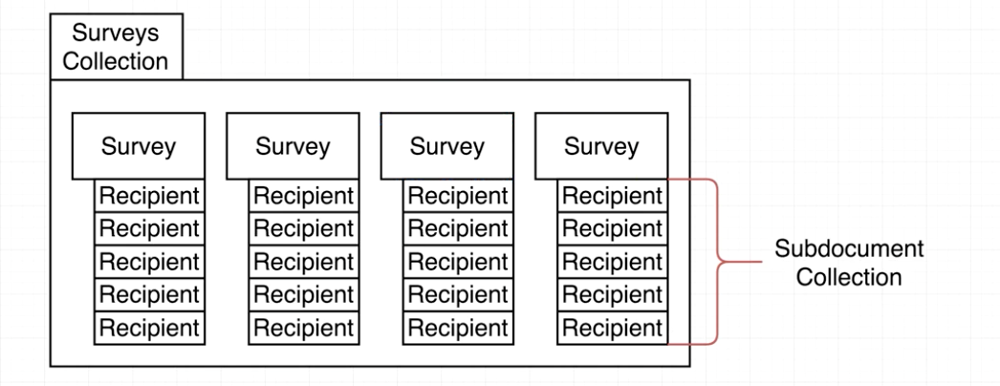

# Mongoose for Survey Creation

### Contents

1. [Intro to Survey](#)
    * [Survey Overview](#)
    * [Server Routes](#)
    * [Survey Model](#)
2. [Database Setup for Surveys](#)
    * [Create Mongoose Class](#)
    * [Model Deficiencies](#)
    * [Limitations of Subdocument Collections](#)
    * [Setting up SubDocs](#)
3. [Back End Setup for Surveys](#)
    * [Survey Creation Route Handler](#)
    * [test](#)
    * [test](#)
    * [test](#)
    * [test](#)
    * [test](#)
    * [test](#)

2. [test](#)

---

### 1. Intro to Survey

#### 1.1. Survey Overview

This is the flow of exactly what's going to happen when the user creates a survey:


The sample email contains a question and two buttons `yes` and `no`. What part of our application do we need to touch for surveys?

#### 1.2. Server Routes

Here are 3 route handlers we need for our Express server:


* `GET /api/surveys:` Find all the surveys.
* `POST /api/surveys/webhooks`: Record the feedback to database.
* `POST /api/surveys:` Create a survey and email to users. It contains the following fields:
  * title
  * subject
  * body
  * recipients: comma separated email address

#### 1.3. Survey Model

We need to save surveys to our database. Remember we need to create a mongoose class to create a collection of records (like database tables) inside of our database:


Since we want to know which user a survey belongs to, there should be some link between users and surveys.

---

### 2. Database Setup for Surveys

#### 2.1. Create Mongoose Class

Let's create the `Survey` class first in mongoose:

```javascript
// ./models/Survey.js
//---------------------------------------------------------
const mongoose = require("mongoose");
const { Schema } = mongoose;
const surveySchema = new Schema({
  title: String,
  body: String,
  subject: String,
  recipients: [String] // Array of strings,
  yes: { type: Number, default: 0 }, // How many users responded with `yes`
  no: { type: Number, default: 0 },
  dateSent: Date,
  lastResponded: Date
});
// Register this schema with mongoose
mongoose.model("surveys", surveySchema);
//---------------------------------------------------------
// ./index.js
//---------------------------------------------------------
// Import the mongoose model we just created:
require("./models/Survey");
```

#### 2.2. Model Deficiencies

We saved recipients as a list of strings in the schema we just created. But this is not a perfect solution.

When a user clicks the button in the email, we need to record the action so that we know who clicks `yes` and how many user have chosen `yes`. If one user clicks the button for 20 times, we don't want to increase the count by 20.

Thus we need a way to identify each user and record who has responded to the email. Here is what we're going to do:


Inside the `recipients` property, we'll embed a sub-document collection. Each document contains a field `clicked` to record whether the user has clicked the buttons.

#### 2.3. Limitations of Subdocument Collections

Let's discuss more about subdocument collections. Recall we created a Surveys collection by defining a mongoose class model (schema).



We use subdocument collections when we want to have a very clear association between two give records. A recipient document only belongs to its parent survey. But as we mentioned before, a user may have multiple surveys, why don't we make surveys as a subdocument collection for `Users`?


The practical reason is that each record is actually a document in `MongoDB`. `MongoDB` has a limit for each document which is 4MB.

#### 2.4. Setting up SubDocs

Make a new file for recipients:

```javascript
// ./models/Recipient.js
//---------------------------------------------------------
const mongoose = require("mongoose");
const { Schema } = mongoose;
const recipientSchema = new Schema({
  email: String,
  responded: { type: Boolean, default: false }
});
// Not register this schema with mongoose, we need to export it.
module.exports = recipientSchema;
```

Then import the schema to `./models/Survey.js` and use the schema to setup the model. Remember we also want to add another property `_user` to record which user the survey belongs to.

```javascript
// ./models/Survey.js
//---------------------------------------------------------
const RecipientSchema = require('./Recipient');
const surveySchema = new Schema({
  ...
  recipients: [RecipientSchema], // A list of schemas
  ...
  _user: { type: Schema.Types.ObjectId, ref: 'User' } // The user this survey belongs to
});
```

---

### 3. Back End Setup for Surveys

#### 3.1. Survey Creation Route Handler
