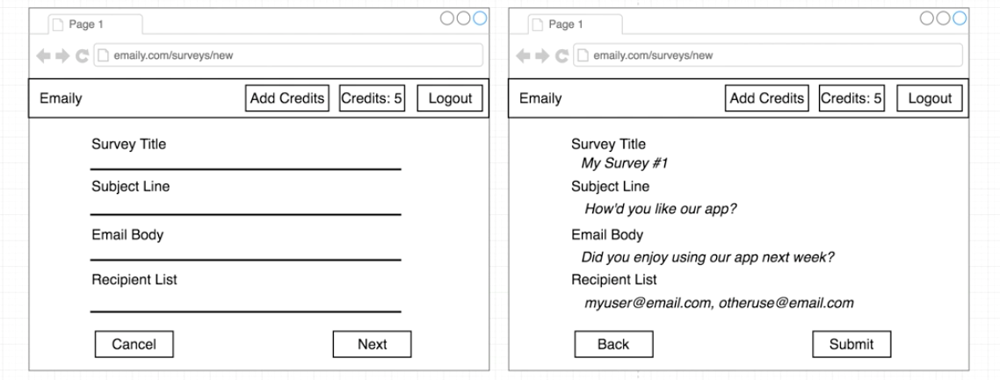
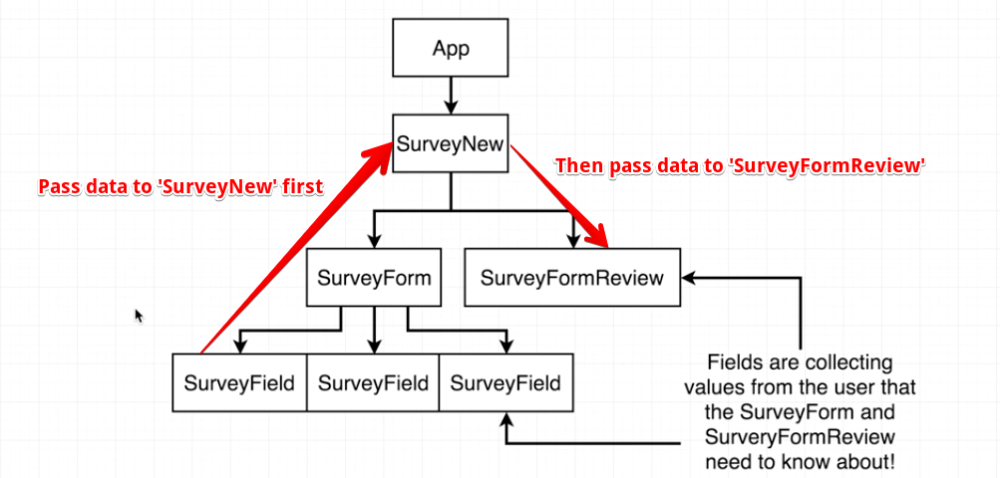
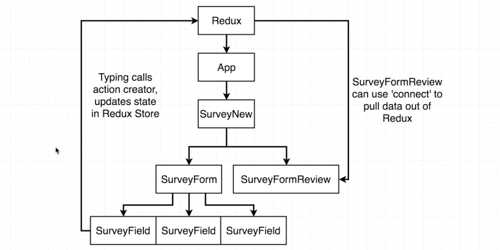

# Client Side Surveys

### Contents

1. [Survey Introduction](#)
    * [Client Side Survey Creation](#)
    * [Material Icons](#)
    * [Navigation with the Link Tag](#)
2. [New Survey Form](#)
    * [Form Structure](#)
    * [Why Redux Form](#)
    * [Redux Form Setup](#)
    * [The ReduxForm Helper](#)
    * [Custom Field Components with 'SurveyField'](#)
    * [Styling the Form](#)

---

### 1. Survey Introduction

#### 1.1. Client Side Survey Creation

We're now done with the route handler for users to create surveys and send emails. We'll move back to the client side and build a form to create a survey. This is a two-stage process:



There is a form in the first stage, the user can also review all the input before going to the back-end. We also need a button for users to go to the form page in the dashboard:


Make a new component file for dashboard: `./client/src/components/Dashboard.js`:

```javascript
// ./client/src/components/Dashboard.js
//---------------------------------------------------------
import React from 'react';
const Dashboard = () => {
  return (
    <div>
      Dashboard
    </div>
  );
};
export default Dashboard;
//---------------------------------------------------------
// ./client/src/components/App.js
//---------------------------------------------------------
import Dashboard from "./Dashboard";
```

#### 1.2. Material Icons

Add a button in the dashboard with the fixed action button in [MaterializeCSS Buttons](http://materializecss.com/buttons.html).

A list of icons can be viewed here: [http://materializecss.com/icons.html](http://materializecss.com/icons.html). Note that the npm module doesn't enable icons by default, we need to include a link in our html file as described in the documentation:

```html
<!-- ./client/public/index.html -->
...
<link href="https://fonts.googleapis.com/icon?family=Material+Icons" rel="stylesheet">
...
```

Then add the button to the dashboard:

```javascript
// ./client/src/components/Dashboard.js
//---------------------------------------------------------
const Dashboard = () => {
  return (
    <div>
      Dashboard
      <div className="fixed-action-btn">
        <a className="btn-floating btn-large red">
          <i className="material-icons">add</i>
        </a>
      </div>
    </div>
  );
};
```

#### 1.3. Navigation with the Link Tag

We use `link` tag to properly navigate inside the React app.

```javascript
// ./client/src/components/Dashboard.js
//---------------------------------------------------------
import { Link } from 'react-router-dom';
const Dashboard = () => {
  return (
    <div>
      Dashboard
      <div className="fixed-action-btn">
        <Link to="/surveys/new" className="btn-floating btn-large red">
          <i className="material-icons">add</i>
        </Link>
      </div>
    </div>
  );
};
```

---

### 2. New Survey Form

#### 2.1. Form Structure

Let's review the mockup first for the form:


To avoid typos, we want to have a new component `SurveyFormReview` for the users to review their input:


Take a look at those two diagrams again, we have several components here.

* The overall component as the container is `SurveyNew`.
* `SurveyNew` has some logic for how to deal with `SurveyForm` and `SurveyFormReview` components.
* `SurveyForm` handles all the form input, while `SurveyField` handles and renders a single field.

#### 2.2. Why Redux Form

We'll use a library `redux-form` to create the form. Let's first talk about how should we create a form without `redux-form` and what problems we may come across. Then we'll explain why we should use `redux-form` and why it would make our lives so easy.

The relationship among related components can be viewed in the diagram:



The problem is that we need to pass the data generated by each `SurveyField` to `SurveyFormReview`. If we don't use `redux-form` and want to pass the data only by `react`, we need to pass down the data from `SurveyField` to `SurveyNew` and then pass them to `SurveyFormReview`. That is quite nasty.

But in the redux world, communicating between different components is much easier, since redux-level state can be updated by calling action creators:



All `redux-form` is doing is saving us the trouble of having to go through the redux settings (`connect`, `mapStateToProps`, etc) by using some helpers that `redux-form` contains. That's why we're using `redux-form`.


#### 2.3. Redux Form Setup

Let's install the `redux-form` and set it up:

```
cd client
npm install --save redux-form
```

[Redux Form Documentation](https://redux-form.com/7.0.4/) might be the best documentation for all libraries I've ever seen before. It has clear explanation and simple examples. Here is an everything we need for a [Simple Form Example](https://redux-form.com/7.0.4/examples/simple/).

What we'll use here is a [Wizard Form](https://redux-form.com/7.0.4/examples/wizard/). It has several stages in the example here: [https://codesandbox.io/s/0Qzz3843](https://codesandbox.io/s/0Qzz3843). We'll walk through the [Start Guide](https://redux-form.com/7.0.4/docs/gettingstarted.md/).

After installing `redux-form`, wire it up with our application by importing all the built-in reducers in `redux-form`:

```javascript
// ./client/src/reducers/index.js
//---------------------------------------------------------
import { reducer as reduxForm } from 'redux-form';
export default combineReducers({
  auth: authReducer,
  form: reduxForm // Access data as 'this.props.form' in other components
});
```

We'll make the survey-related components (saved in `./client/src/components/surveys/SurveyNew.js`) and make them work together:

```javascript
// ./client/src/components/surveys/SurveyNew.js
//---------------------------------------------------------
// This should be a class-based component
import React, { Component } from 'react';
class SurveyNew extends Component {
  render() {
    return (
      <div>SurveyNew</div>
    );
  }
}
export default SurveyNew;
//---------------------------------------------------------
// ./client/src/components/App.js
//---------------------------------------------------------
import SurveyNew from "./surveys/SurveyNew";
```

#### 2.4. The ReduxForm Helper

Remember the purpose for `SurveyNew` is to show `SurveyForm` and `SurveyFormReview` and toggle the visibility between them.

```javascript
// ./client/src/components/surveys/SurveyForm.js
//---------------------------------------------------------
import React, { Component } from 'react';
class SurveyForm extends Component {
  render() {
    return (
      <div>SurveyForm</div>
    );
  }
}
export default SurveyForm;
```

Then import `SurveyForm` into `SurveyNew` and show it:

```javascript
// ./client/src/components/surveys/SurveyNew.js
//---------------------------------------------------------
import SurveyForm from './SurveyForm';
class SurveyNew extends Component {
  render() {
    return (
      <div><SurveyForm /></div>
    );
  }
}
```

Now let's move on the `SurveyForm`, we may need lots of code here. Note that it should be hook up with `redux-form`. We import two helpers here:

* **`reduxForm`:** It allows `redux-form` to communicate with our redux store. It is similar to the `connect` helper we used in the redux library.
* **`Field`:** It allows us to create any traditional html form elements (text, textarea, dropdown, checkbox, file input, ...).

Let's forget `SurveyField` for now and try to have a text-input in our form.

```javascript
// ./client/src/components/surveys/SurveyForm.js
//---------------------------------------------------------
import { reduxForm, Field } from 'redux-form';
class SurveyForm extends Component {
  render() {
    // 'handleSubmit()' is added by `redux-form` as props.
    return (
      <div>
        <form onSubmit={this.props.handleSubmit(values => console.log(values))}>
          <Field
            type="text"
            name="surveyTitle"
            component="input" />
          <button type="submit">Submit</button>
        </form>
      </div>
    );
  }
}
// It takes only one argument object with the configurations how we want the form to behave.
export default reduxForm({
  form: 'surveyForm'
})(SurveyForm);
```

Let's test it by entering some text and clicking the `submit` button:


#### 2.5. Custom Field Components with 'SurveyField'

Now we have a basic text-input in our app. Note that `type`, `name` and `component` are 3 basic attributes for a `Field` component. We can use our own component to replace plain text for the `component` attribute: `component={SurveyField}`.

Let's refactor the `SurveyForm` component and extract the `Field` helper tag to separate `SurveyField` components.


```javascript
// ./client/src/components/surveys/SurveyField.js
//---------------------------------------------------------
// 'SurveyField' contains logic to render a single label and text input.
import React from 'react';
export default (props) => {
  console.log(props);
  return (
    <div>
      <input />
    </div>
  );
};
```

Then import 'SurveyField' and use a helper function to render each field with `component` to be our own component `SurveyField`:

```javascript
// ./client/src/components/surveys/SurveyForm.js
//---------------------------------------------------------
// Import 'SurveyField' and use a helper function to render each field
import SurveyField from './SurveyField';
class SurveyForm extends Component {
  // Helper function to render a 'SurveyField'
  renderFields() {
    return (
      <div>
        <Field label="Survey Title" type="text" name="title" component={SurveyField} />
      </div>
    );
  }

  render() {
    // 'handleSubmit()' is added by `redux-form` as props.
    return (
      <div>
        <form onSubmit={this.props.handleSubmit(values => console.log(values))}>
          {this.renderFields()}
          <button type="submit">Submit</button>
        </form>
      </div>
    );
  }
}
```

After wiring up `SurveyField` (as the component) with `reduxForm.Field`, lots of fields are passed into `SurveyField` as props (we printed them out):


It is noticed that `redux-form` has generated lots of event handlers in `props.input` to the field we're rendering. Let's use the event handlers and update our component `SurveyField`.

Note that the props like `label` are passed by attributes defined in `<Field>` in `SurveyForm`.

```javascript
// ./client/src/components/surveys/SurveyForm.js
//---------------------------------------------------------
class SurveyForm extends Component {
  renderFields() {
    return (
      <div>
        <Field
          label="Survey Title"
          type="text"
          name="title"
          component={SurveyField}
        />
        <Field
          label="Subject Line"
          type="text"
          name="subject"
          component={SurveyField}
        />
        <Field
          label="Email Body"
          type="text"
          name="body"
          component={SurveyField}
        />
        <Field
          label="Recipient List"
          type="text"
          name="emails"
          component={SurveyField}
        />
      </div>
    );
  }

  render() { ... }
}
```

```javascript
// ./client/src/components/surveys/SurveyField.js
//---------------------------------------------------------
export default (props) => {
  return (
    <div>
      <label>{label}</label>
      <input {...input} />
    </div>
  );
};
```

Now we have four input boxes with labels. To avoid duplicate `Field` in `SurveyForm`, we can define an array:

```javascript
// ./client/src/components/surveys/SurveyForm.js
//---------------------------------------------------------
import _ from "lodash"; // Use map function here
const FIELDS = [
  { label: "Survey Title", name: "title" },
  { label: "Subject Line", name: "subject" },
  { label: "Email Body", name: "body" },
  { label: "Recipient List", name: "emails" }
];
class SurveyForm extends Component {
  renderFields() {
    return _.map(FIELDS, field => {
      return (
        <Field
          component={SurveyField}
          type="text"
          label={field.label}
          name={field.name}
        />
      );
    });
  }

  render() { ... }
}
```

#### 2.6. Styling the Form

Modify the styles to make it looks better. We also got a `Cancel` button to go back to the dashboard.

```javascript
// ./client/src/components/surveys/SurveyForm.js
//---------------------------------------------------------
import { Link } from 'react-router-dom';
class SurveyForm extends Component {
  renderFields() {...}
  render() {
    return (
      ...
      <Link to="/surveys" className="red btn-flat white-text">
        Cancel
      </Link>
      <button type="submit" className="teal btn-flat right white-text">
        Submit
        <i className="material-icons right">done</i>
      </button>
      ...
    );
  }
}
```
