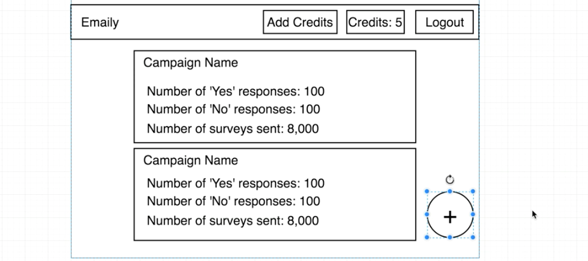

# Client Side Surveys

### Contents

1. [Survey Introduction](#)
    * [Client Side Survey Creation](#)
    * [Material Icons](#)
    * [Navigation with the Link Tag](#)
2. [New Survey Form](#)
    * [test](#)
    * [test](#)
    * [test](#)

---

### 1. Survey Introduction

#### 1.1. Client Side Survey Creation

We're now done with the route handler for users to create surveys and send emails. We'll move back to the client side and build a form to create a survey. This is a two-stage process:


There is a form in the first stage, the user can also review all the input before going to the back-end. We also need a button for users to go to the form page in the dashboard:



Make a new component file for dashboard: `./client/src/components/Dashboard.js`:

```javascript
// ./client/src/components/Dashboard.js
//---------------------------------------------------------
import React from 'react';
const Dashboard = () => {
  return (
    <div>
      Dashboard
    </div>
  );
};
export default Dashboard;
//---------------------------------------------------------
// ./client/src/components/App.js
//---------------------------------------------------------
import Dashboard from "./Dashboard";
```

#### 1.2. Material Icons

Add a button in the dashboard with the fixed action button in [MaterializeCSS Buttons](http://materializecss.com/buttons.html).

A list of icons can be viewed here: [http://materializecss.com/icons.html](http://materializecss.com/icons.html). Note that the npm module doesn't enable icons by default, we need to include a link in our html file as described in the documentation:

```html
<!-- ./client/public/index.html -->
<!------------------------------------------------------------->
...
<link href="https://fonts.googleapis.com/icon?family=Material+Icons" rel="stylesheet">
...
```

Then add the button to the dashboard:

```javascript
// ./client/src/components/Dashboard.js
//---------------------------------------------------------
const Dashboard = () => {
  return (
    <div>
      Dashboard
      <div className="fixed-action-btn">
        <a className="btn-floating btn-large red">
          <i className="material-icons">add</i>
        </a>
      </div>
    </div>
  );
};
```

#### 1.3. Navigation with the Link Tag

We use `link` tag to properly navigate inside the React app.

```javascript
// ./client/src/components/Dashboard.js
//---------------------------------------------------------
import { Link } from 'react-router-dom';
const Dashboard = () => {
  return (
    <div>
      Dashboard
      <div className="fixed-action-btn">
        <Link to="/surveys/new" className="btn-floating btn-large red">
          <i className="material-icons">add</i>
        </Link>
      </div>
    </div>
  );
};
```

---

### 2. New Survey Form

#### 2.1. SurveyNew Form

Let's review the mockup first for the form:


To avoid typos, we want to have a new component `SurveyFormReview` for the users to review their input:


